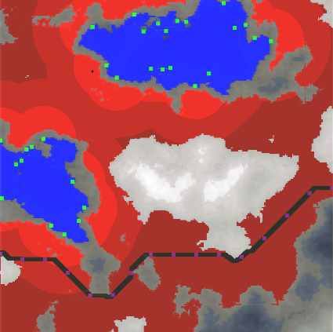
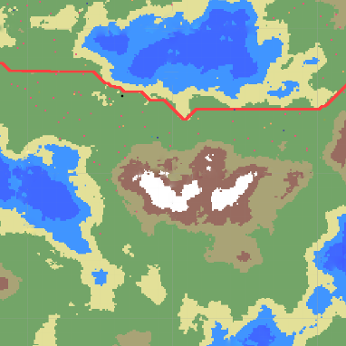

# SettlementSimulation.Engine
C# library for simulation development of human settlement 
based on genetic algorithm.
## Installation
SettlementSimulation.Engine can be installed using the Nuget package manager or the dotnet CLI.  
```
Install-Package SettlementSimulation.Engine
```
## Usage

At first we have to load heightmap and colormap of our settlement.  
Both have to describe the same region and they must be represented as
1024x1024 pixel bitmaps.  
Apart from them we should also define the height range in which  
buildings can be located.  
By default this range will be set to 100-180  
(notice that the upper limit for height is 255 - max byte value,  
and lowe limit is 0 - min byte value ).  
Regions representeing water in the color map must 
have pixel intesity in following ranges:  
250 <= blue <= 255   
0 <= red <=  5   
50 <= green <= 120  
Example of heightmap and colormap that can be used:  
  


```csharp
using SettlementSimulation.AreaGenerator;
...
var settlementInfo = await new SettlementBuilder()
                .WithColorMap(_colorMap)
                .WithHeightMap(_heightMap)
                .WithHeightRange(_minHeight, _maxHeight)
                .BuildAsync();
```  
settlementInfo will contain 1024x1024 matrix with fields,  
preview bitmap - to view the settlement area that was found  
and main road as a collection of points(main road is also marked in the preview bitmap).


  
Settlement region( in which bilding can be generated) is marked  
as red(intensity shows the distance to the water), road is displayed  
as black line. Each field in field marix have information about  
how far is water and road from this field, for optimization purposes   
(to avoid comparing field position with every point in water aquens and road)  
this distance is liited to the green points on water aquens boundary  
and purpuple points on road.  
 
To start simualtion we'll use class StructureGenerator, passing 
previusly obtained settlementInfo.  
```csharp
using SettlementSimulation.Engine;
using SettlementSimulation.Engine.Models.Buildings;
...

var maxIterations = 1000;
var breakpoints = new List<int>{100,200,400,600};

var generator = new StructureGeneratorBuilder()
                .WithMaxIterations(maxIterations)
                .WithBreakpoints(breakpoints)
                .WithFields(settlementInfo.Fields)
                .WithMainRoad(settlementInfo.MainRoad)
                .Build();

generator.Breakpoint += OnBreakpoint;
generator.NextEpoch += OnNextEpoch;
generator.Finished += OnFinished;
            
generator.Start();

...
       
private void OnBreakpoint(object sender, EventArgs e)
{
    var settlementState = generator.SettlementState;
    foreach (var building in SettlementState.Structures.Where(s=>s is Building).Cast<Building>())
    {
        var buildingLocation = building.Location.Point;
        var buildingType = building.GetType().Name;
        //display building
    }

    //Similarly for roads
}

private void OnNextEpoch(object sender, EventArgs e)
{
    //Do something
}

private void OnFinished(object sender, EventArgs e)
{
    //Do something
}
```  

Example of generated buildings displayed together with the main road
on the colormap:  

