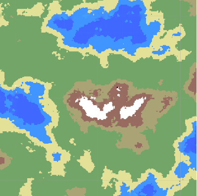
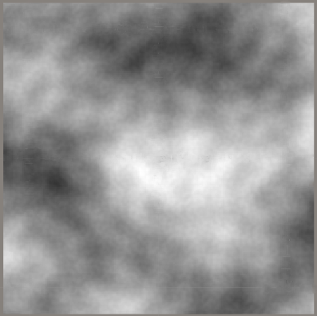

# SettlementSimulation.Engine

At first we have to load heightmap and color map of our settlement,
both must represent the same region. The only available format is 
1024x1024 bitmap. Appart from them we can also define the height range 
to limit the settlement area.
Important: regions representeing water in the color map must 
have pixel intesity:  
250 <= blue <= 255   
0 <= red <=  5   
50 <= green <= 120  
```csharp
using SettlementSimulation.AreaGenerator;
...
var settlementInfo = await new SettlementBuilder()
                .WithColorMap(_colorMap)
                .WithHeightMap(_heightMap)
                .WithHeightRange(_minHeight, _maxHeight)
                .BuildAsync();
```  
Example of heightmap and colormap that can be used:



settlementInfo will contain 1024x1024 matrix with fields, 
preview bitmap - to view the settlement area that was found
and main road as a collection of points(main road is also marked in the prevew bitmap).


  
Settlement region( in hich bilding can be generated) is marked
as red(intensity shows the distance to the water), road is displayed
as black line. Each field in field marix have information about 
how far is water and road from this field, for optimization purposes 
(to avoid comparing filed position with every point in water aquens and road)
this distance is liited to the green points on water aquens boundary
and purpuple points on road.  
 
