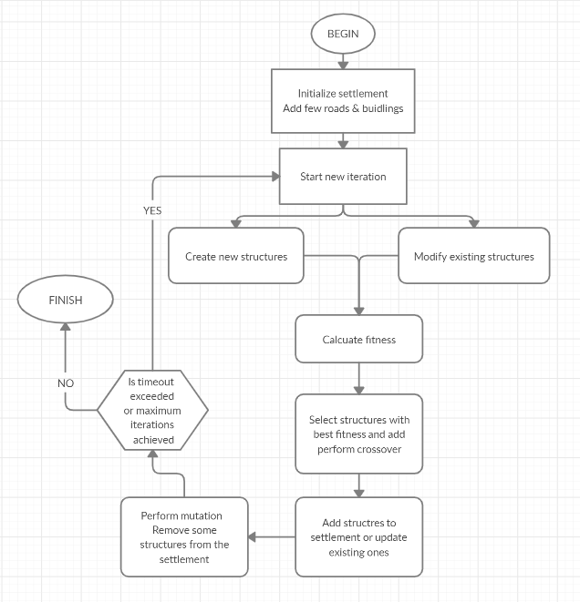
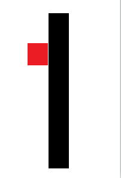
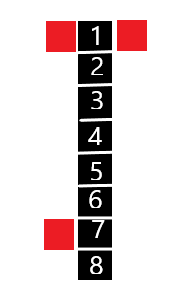

# SettlementSimulation.Engine
C# library for simulation development of human settlement.
## Installation
SettlementSimulation.Engine can be installed using the Nuget package manager or the dotnet CLI.  
```
Install-Package SettlementSimulation.Engine
```
## Usage

At first we have to load heightmap for our settlement.

Example of heightmap that can be used:  


```csharp
using SettlementSimulation.AreaGenerator;
using System.Drawing;
...
var heightMap = new Bitmap("path to heightmap");

var settlementInfo = await new SettlementBuilder()
    .WithHeightMap(this.BitmapToPixelArray(heightMap))
    .BuildAsync();

//to tranfrom bitma to pixel array we can this function
private Pixel[,] BitmapToPixelArray(Bitmap bitmap)
        {
            var pixels = new Pixel[bitmap.Width, bitmap.Height];
            for (int i = 0; i < bitmap.Width; i++)
            {
                for (int j = 0; j < bitmap.Height; j++)
                {
                    var color = bitmap.GetPixel(i, j);
                    pixels[i, j] = new Pixel(color.R, color.G, color.B);
                }
            }

            return pixels;
}

```  

settlementInfo will contain Field matrix reprezenting our heightmap with 
additional information for each field:  
-distance to water,
-distance to main road, 
-type of terrain,
-info whether pixel is in settlement area
  
Additionally settlementInfo will contain
preview bitmap with marked settlement area
and main road as a collection of points(main road is also marked in the preview bitmap).


  
Settlement region( in which building can be generated) is marked  
as red(intensity shows the distance to the water), road is displayed  
as black line. Each field in field marix have information about  
how far is water and road from this field, for optimization purposes   
(to avoid comparing field position with every point in water aquens and road)  
this distance is liited to the green points on water aquens boundary  
and purpuple points on road.  
 
To start simualtion we'll use class StructureGenerator, passing 
previusly obtained settlementInfo.  
```csharp
using SettlementSimulation.Engine;
using SettlementSimulation.Engine.Models.Buildings;
...

var maxIterations = 1000;
var breakpointStep = 1;

var generator = new StructureGeneratorBuilder()
                .WithMaxIterations(maxIterations)
                .WithBreakpointStep(1)
                .WithFields(settlementInfo.Fields)
                .WithMainRoad(settlementInfo.MainRoad)
                .Build();

generator.Breakpoint += OnBreakpoint;
generator.NextEpoch += OnNextEpoch;
generator.Finished += OnFinished;
            
generator.Start();

...
       
private void OnBreakpoint(object sender, EventArgs e)
{
    var settlementState = generator.SettlementState;
    //Do something
}

private void OnNextEpoch(object sender, EventArgs e)
{
    //Do something
}

private void OnFinished(object sender, EventArgs e)
{
    //Do something
}
```  

When breakpoint event occurs we can access current settlement state 
of the simulation:

```csharp
 public class SettlementState
    {
        public IRoad MainRoad { get; set; }
        
        //all roads currently in settlemnt
        public List<IRoad> Roads { get; set; } 

        //approximated center of the settlement
        public Point SettlementCenter { get; set; } 

        // buildings added to settlement in the last generation
        public IEnumerable<ISettlementStructure> LastCreatedStructures { get; set; } 
       
        public Epoch CurrentEpoch { get; set; }
        public int CurrentGeneration { get; set; }
        public int Time { get; set; }
    }
```

## Algorithm description

At the begin of th simulation we create empty settlement and initialize it with few roads and buildings.  
Then unitl maximum number of iterations is reached or specyfied timeout is exceeded we  
modify our settlement by adding new structures or    
removing and changing the exisiting ones.   
Each time we update the settlement we generate multiple sets of possible structures(that are supposed to be added or changed). 
Next we must compute fitness for each set, we do it by checking how well given structure fits current settlement.   
Rules for computing fitness/scoring buildings are described in section below called: 'Rules for scoring buildings'.  
After that we take 2 sets with best overall fitness(we sum fitness of each structure in the set) and perform crossover:  
if we generated roads and they don't collide/cross with each other we add both of the to the new settlement, otherwise  
we add only the one with better fitness score.  
Similary when we generated only buildings: then if some building from first set has the same position as the other  
building from second set we add to the settlement only the one with higher fitness.  
Instead of adding new structures we can also update the existing one i.e some buildings can change their types.
We decide wheter to add or change structures at random but the probability of selecting one option over another  
may vary according to current epoch (More in section 'Division simulation time into 3 epochs')  
Finally before the iteration is finished there is some probability that mutation can occur.  
If that would happen some of the buildings and roads will be destroyed depeing of the type of the mutation.(See 'Mutations').  

### Division simulation time into 3 epochs
When settlement reaches new level of development some building types unavailable
in previous iterations can be now generated. These levels are called 'epochs' 
and symbolize how well settlement is developed. 
Prooperties of each epoch:  
- First epoch:
    Available building: residence, market, tavern.
    Condions that must be fullfiled to enter second epoch:  
    1) more that 500 buildings,
    2) at least 1 market,
    3) at least 3 taverns
- Second epoch:
    Available buildings: all from first epoch + school, church, administration building.
    Condions that must be fullfiled to enter third epoch:  
    1) more that 3000 buildings,
    2) at least 1 administration building,
    3) at least 2 schools,
    4) at least 1 church
 - Third epoch:
    Available buildings: all from first and second epoch + port, university.
 
### Mutations
 
In simulation mutations were introduced to imitiate natural disasters that can have major impact of
the shape of the settlement.  
Types of mutations that are supported and implemented:    
1) Flood: all roads and buildings near big enough water aquen are removed from settlement. 
2) Earthquake: randomly remove buildings across whole settlement. Older buildings 
are more probable to be removed.

  


### Types of structures that can be generated in the simulation
* Buildings
There are 8 types of buildings currently supported. 
Each road is attached to one or two buildings 
(second case is only when building is next to the crossroads). 
Properties of buildings:
  - Probability: each building has fixed probability of being generated,
    common buildings like residences will have much higher probabilty than 
    buildings that usually are only few in settlements like schools or ports.
  - Space: since some buildings vary in terms of size i.e tavern takes 
    more space than residence but less than market.
  - Direction: determines the orientation of the building towards 
    the roads to which it is attached. For example on the picture below
    building (red square) would have Direction set to Right, because 
    on its right side the is road (black line). 
  - Age: how many iterations building is a part of the settlement.
 
  - Position: point location (x,y) which is the center location of the building.
* Roads
Two types of road are distiguished:
  - paved road and,
  - unpaved road  
For simplification purposes, except from Main Road, 
all other roads can be made only as horizantal or vertical line.
Prior to that in most important road properties there are:
- Segments: road is dividided into collection of segmenents, 
each conting single road point and buildings attached to it.
Example below shows road with eight segments, 
first segment with 2 buildings and seventh segment with one.  

 

We can see that single segment can have attached up to 3 buildings - when segment 
is last or first.  
Wheter a road is paved or unpaved is determined by 3 factors:  
- Distance road to the settlement center,
- Length of the road, 
- Buildings attached to this road
- Current epoch

The formula is as follows:  
1. Set probability P for road to be paved to 0.
2. If distance to the settlement center is less than 1/4 
   of the current settlement radius add 0.2 to P.
3. If length of the road is greater than 1/2 of the max 
   road length(specyfied in the settings) add 0.1 to P
4. For each building attached to the road, if the building 
   is residence then add 0.01 to P, otherwise if it's more rare 
   structure then add 0.05
5. If current epoch is First, add 0.1 to P, 
   if Second add 0.2 and if Third then add 0.4.
6. We draw the type of the road using 
   calculated probability P.

Using this formula we can assume that most of the paved roads will 
be placed close to the center of the simulation, 
when road have attached many building, 
when road is long and when the settlement will be well developed

### Rules for scoring buildings
To determine how similar created settlement is to the real one we define 
rules for each type of builing that answer the question wheter given 
building is good fit in specyfic place in the settlement, given how well
developed is settlement at a current time of simulation.  
All rules can check some of the following scenarios:  
1. How far building is from settlement center, wheter it is located in 
the suburbs or the center of the settlement.
2. The number of buildings of the same type located in direct building 
neighbourhood or in the whole settlement
3. Relationships between different types of buildings - some buildings should 
appear only when there is sufficent number of other type of builing.
4. Distance from building to specyfic terrrain type.
5. Density of the direct neighborhood - how many buildings exists in the
area near to the building.  
[TODO]6. Building can be attached only to specyfic type of road

Below are listed rules described above, for each supported type of buildding:  
- Residence: ~
- Tavern:  
    5) at least 50 residences in tavern-neighborhood-20.
    Additionaly 3) if distance from tavern to settlement center is less than 15,
    then in tavern-neighborhood-10 there must be no less than 5 residences per one tavern,
    otherwsie  if distance from tavern to settlement center is greater than 15,
    then in tavern-neighborhood-10 there must be no less than 10 residences per one tavern.         
- Market:  
     2) no other markets in neighbourhood-20,  
     3) at least 100 residences in neighbourhood-20
- School:  
     3) there must be at least 100 residences per one school, 
- Church:  
     2) no other churches in neighbourhood-20  
     3) at least 100 residnces in this neighbourhood 
- Administration:  
     1) building must be in settelement center neighbourhood-10  
     3) there can be no more that 1 admistration buildings per 1000 buildings
- Port:  
    4) distance to water must be less or equal to 10.  
    2) there can be only one port in the settlement    
- University:  
    3) there must be at least 5 schools per one university,

*neighbourhood-x - all fields which distance to building is less or equal than 'x'
